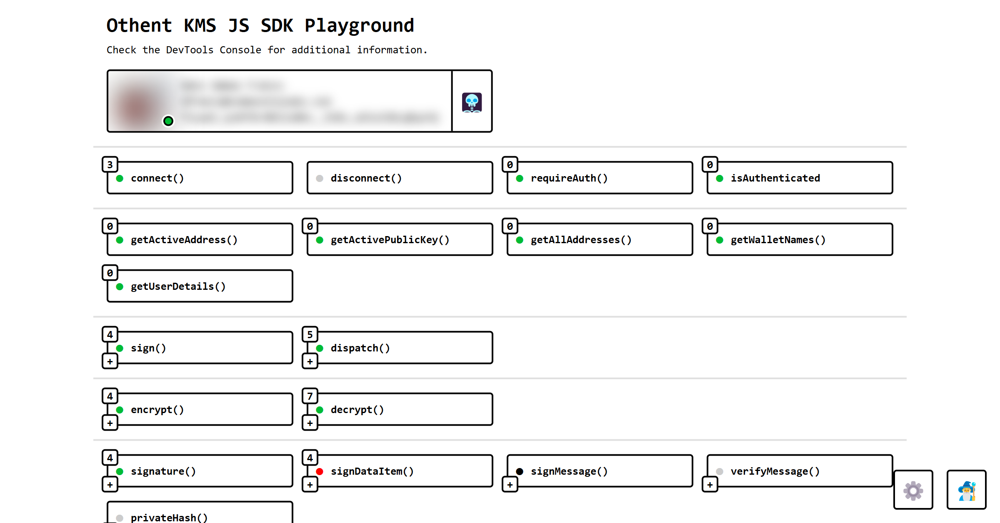

# Othent KMS JS SDK Demo

An example test repo using Othent KMS JS SDK to manage Arweave custodial wallets backend by Auth0 and Google Key Management Service.

Try our demo at [kms-demo.othent.io](https://kms-demo.othent.io)!

<br />

[](https://www.npmjs.com/package/@othent/kms)

<br />

[](https://kms-demo.othent.io)

<br />

Learn how to set it up at https://docs.othent.io or looking at our demo's code at https://github.com/Othent/KMS-test-repo.

<br />

## Running it locally:

```
  pnpm install
  pnpm start
```

To run it with a local `KeyManagementService` instance:

1. Clone [`@othent/kms`](https://github.com/Othent/KeyManagementService) in the same directory where you cloned this
   project.

2. Inside `@othent/kms` (`../KeyManagementService`), run `pnpm dev`.

3. Inside this repo, run:

   - `pnpm link ../KeyManagementService/`. See [`pnpm link`](https://pnpm.io/cli/link).

     You can later revert this with `pnpm unlink ./KeyManagementService/` or `pnpm unlink @othent/kms`.

   - or set `"@othent/kms": "file:../KeyManagementService"`.

     You can later revert this with `pnpm add @othent/kms@latest`.

<br />
